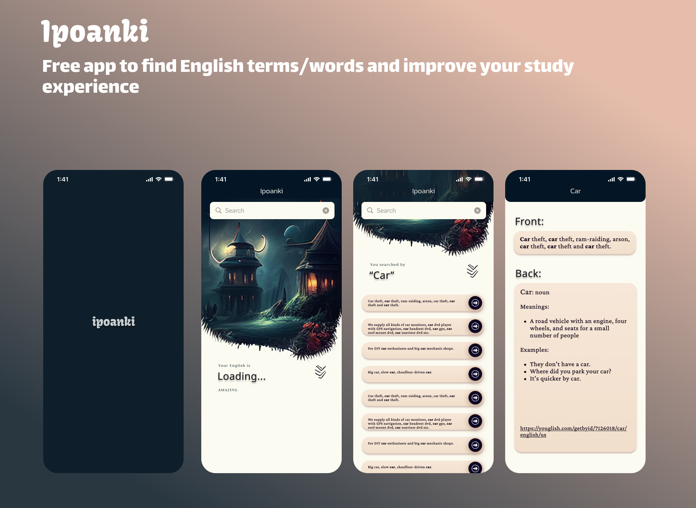

  

<h2 align="center">
    Ipoanki
</h2>

Free app to find English terms/words and improve your study experience

  

## What is this ?

Ipoanki is an application to improve the study of English vocabulary. It mines English phrases from a word and
returns meanings and other example sentences.

## Features

- Find phrases from a word
- Choose the best phrase for your study
- See meanings and examples of sentences
- Press cards to copy their contents
- Access the text link to hear the chosen term with video and audio

## Download

[Become a Tester](https://appdistribution.firebase.dev/i/6b78e9a7d8d8d468)

[Download the App](https://github.com/WagnerMagnus1/ipoanki/releases)

## Development Process

Serenity is open to contributions, but I recommend creating an issue or replying in a comment to let me know what you are working on first that way we don't overwrite each other.

## License

This program is free software: you can redistribute it and/or modify it under the terms of the GNU Affero General Public License as published by the Free Software Foundation, either version 2 of the License, or (at your option) any later version.