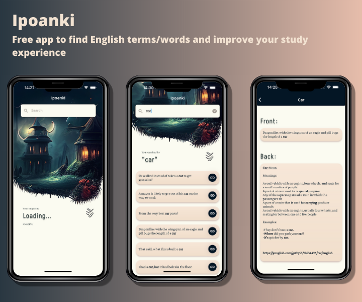

  

<h2 align="center">
    Ipoanki
</h2>

Free app to find English terms/words and improve your study experience

  

## Download

[Become a Tester](https://appdistribution.firebase.dev/i/Dv8WUupp)

[Download the App](https://github.com/YajanaRao/Serenity/releases)

## What is this ?

Serenity is a audio player which focuses on playing Music, Meditation and Podcasts. It let's you stream audio from various sources including Local and Online storage devices

## Pre-alpha release

The current version is a pre-alpha early access. Some of it is usable, some of it isn't. If there are things that don't work as expected or are counterintuitive, please open an issue so I can prioritize working on them.

## Features

- Listen to audio from local library
- Browsing by genre
- Create playlists and play audio from saved playlists
- Manage audio queue
- Radio mode (automatically queue similar tracks)
- Searching for and playing music from YouTube (including integration with YouTube playlists)
- Voice search songs

## Development Process

Serenity is open to contributions, but I recommend creating an issue or replying in a comment to let me know what you are working on first that way we don't overwrite each other.

Please read [Setup.md](docs/Setup.md) for details on this project.

## Our Community

You can join [Telegram group](https://t.me/serenityapp) or [Discord Channel](https://discord.gg/7UAUjhq3kN)

## License

This program is free software: you can redistribute it and/or modify it under the terms of the GNU Affero General Public License as published by the Free Software Foundation, either version 3 of the License, or (at your option) any later version.

### Support

[Become a Patron!](https://www.patreon.com/bePatron?u=28198536)

[Support via Paypal](https://paypal.me/YajanaRao?locale.x=en_GB)